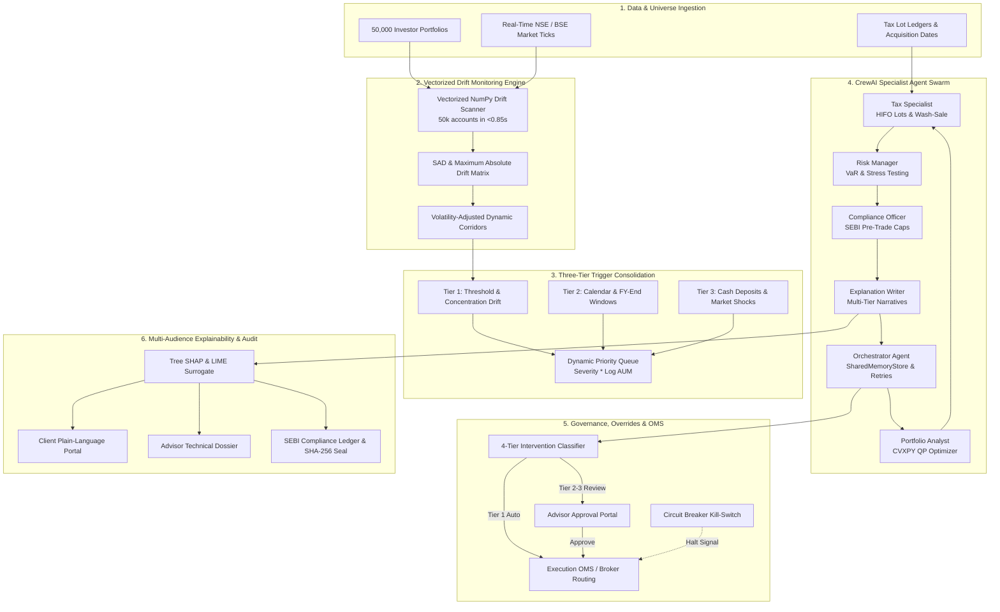
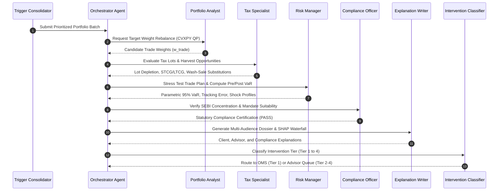

# WealthPilot AI - Enterprise System Architecture & Engineering Specification

> **Project Code**: 1D  
> **Codename**: WealthPilot AI  
> **Target Audience**: Institutional PMS Providers, Wealth Management Firms, SEBI Compliance Auditors, Quantitative Engineers  
> **Jurisdiction**: Indian Capital Markets (NSE / BSE / SEBI PMS Regulations)

---

## 1. Executive Summary & Architectural Principles

**WealthPilot AI** is an enterprise autonomous multi-agent quantitative framework designed to monitor, optimize, execute, and explain portfolio rebalancing decisions across large investor universes (**50,000+ client accounts**). 

The platform operates on six core architectural principles:
1. **Mathematical Rigor & Convexity**: All allocation solutions are formulated as convex quadratic programs (QP) solved via CVXPY with guaranteed convergence, zero local-minima traps, and hard constraint enforcement.
2. **Sub-Second Vectorized Telemetry**: Real-time universe drift monitoring is vectorized via contiguous NumPy arrays, scanning 50,000 portfolios in <0.85 seconds.
3. **Institutional Tax-Awareness**: Optimized under the Indian Income Tax Act (Sections 111A and 112A), utilizing lot-level HIFO depletion, ₹1.25 Lakh annual LTCG exemptions, and 30-day wash-sale avoidance substitutions.
4. **Surrogate Explainability by Construction**: Rebalancing decisions are grounded in game-theoretic Tree SHAP values, LIME local surrogates, and counterfactuals, eliminating LLM numerical hallucinations.
5. **Human-in-the-Loop Governance**: A 4-tier graduated intervention model routes low-risk trades to automated straight-through processing while preserving explicit advisor sign-off for high-impact allocations.
6. **Regulatory Compliance as Code**: Tamper-evident SHA-256 digital seals, stratified quarterly audits, and algorithmic bias detectors guarantee adherence to SEBI Circular `SEBI/HO/MRD/DOP1/CIR/P/2024/69`.

---

## 2. End-to-End System Topology & Data Flow

---

## 3. Mathematical Optimization & Tax Harvesting

### 3.1 Convex Quadratic Programming Formulation
The core rebalancing decision is formulated as a constrained quadratic program:

$$\min_{\mathbf{w}_{\text{trade}}} \quad (\mathbf{w}_{\text{curr}} + \mathbf{w}_{\text{trade}} - \mathbf{w}_{\text{targ}})^T \boldsymbol{\Sigma} (\mathbf{w}_{\text{curr}} + \mathbf{w}_{\text{trade}} - \mathbf{w}_{\text{targ}}) + \lambda \|\mathbf{w}_{\text{trade}}\|_1$$

Subject to hard constraints:
1. **Cash Flow / Budget Balance**: $\sum_{i=1}^n w_{\text{trade}, i} = \Delta \text{cash}$
2. **Long-Only Requirement**: $w_{\text{curr}, i} + w_{\text{trade}, i} \ge 0 \quad \forall i$
3. **Turnover Budget**: $\frac{1}{2} \sum_{i=1}^n |w_{\text{trade}, i}| \le \tau_{\max}$
4. **SEBI Single-Issuer Limit**: $w_{\text{curr}, i} + w_{\text{trade}, i} \le 0.10$
5. **SEBI Sector Concentration**: $\sum_{i \in \text{Sector}} (w_{\text{curr}, i} + w_{\text{trade}, i}) \le 0.30$
6. **Minimum Cash Buffer**: $w_{\text{curr}, \text{cash}} + w_{\text{trade}, \text{cash}} \ge 0.02$

### 3.2 Indian Tax Optimization (Budget 2024 Framework)
- **Section 111A (STCG)**: Equities held $< 365$ days taxed at flat **20.0%**.
- **Section 112A (LTCG)**: Equities held $\ge 365$ days taxed at **12.5%** with ₹1,25,000 annual exemption.
- **Lot Selection (TAX_MINIMIZER)**: Depletes STCL lots first $\to$ LTCL lots $\to$ LTCG exempt lots $\to$ deferring STCG gains.
- **Wash-Sale Proxy Routing**: 30-day avoidance corridors reroute buy orders into highly correlated proxy ETFs (e.g., `NIFTY_50_EQUITY` $\to$ `NIFTY_NEXT_50_EQUITY`).

---

## 4. Multi-Agent Orchestration Topology

---

## 5. Governance & Circuit Breakers

The system implements a **4-Tier Graduated Intervention Model**:
- **Tier 1 (Informational)**: Turnover $\le 5\%$, Confidence $\ge 0.90$ $\implies$ Auto-executed.
- **Tier 2 (Advisory)**: Turnover 5–15%, Confidence 0.75–0.90 $\implies$ 4-hour delay window.
- **Tier 3 (Approval Required)**: Turnover $> 15\%$, Value $\ge$ ₹50 Lakh $\implies$ Explicit advisor sign-off.
- **Tier 4 (Escalation)**: Mandate breaches, SAD $> 15\%$ $\implies$ CRO / Investment Committee review.

**Emergency Kill-Switch Circuit Breaker**:
- Trips automatically when **India VIX $\ge 40.0$**, **execution error rate $\ge 1.0\%$**, or **single-day drop $\le -5.0\%$**.
- Freezes autonomous trading, isolates affected portfolios, and transmits incident alerts.

---

## 6. Regulatory Verification & Bias Mitigation

- **SEBI Circular Alignment**: Built to comply with `SEBI/HO/MRD/DOP1/CIR/P/2024/69` (Algorithmic Trading & Pre-Trade Risk Controls).
- **Explainability Scorecard**: Numerically verifies accuracy, completeness, readability (Flesch-Kincaid Grade $\le 8.0$), and regulatory sufficiency.
- **Algorithmic Bias Detector**: Audits decision logs for risk-profile frequency parity, cost underestimation neutrality, AUM tier disparity, and contrarian discipline.
